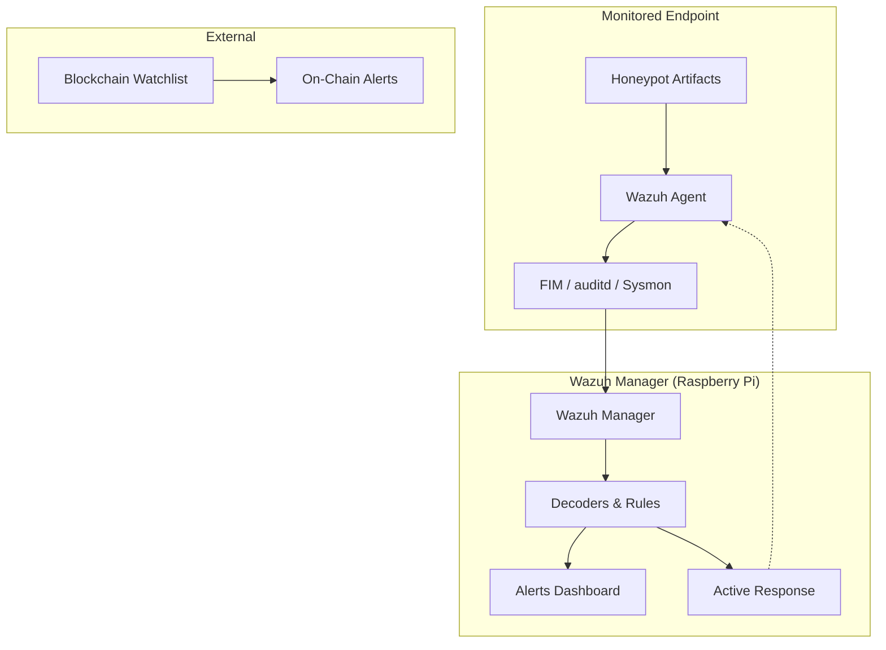

# Architecture Overview: Crypto Wallet Honeypot

The Crypto Wallet Honeypot system is designed to provide high-fidelity detection of attackers and automated malware targeting cryptocurrency assets. It employs a multi-layered detection strategy to ensure that even sophisticated threats are caught at various stages of the attack lifecycle.

## Detection Strategy

The system utilizes a 4-layer detection approach:

### Layer 1: File Integrity Monitoring (FIM)
- **Mechanism:** Wazuh FIM module (syscheck).
- **Description:** Monitors honeypot wallet files and directories for any access (read), modification, or deletion.
- **Alerting:** Generates high-priority alerts (Level 12+) since legitimate users have no reason to access these hidden/decoy paths.

### Layer 2: Process Auditing & Behavioral Analysis
- **Mechanism:** Linux `auditd` and Windows Sysmon.
- **Description:** Tracks *which* process and *which* user accessed the honeypot files. It detects filesystem enumeration and rapid multi-file access patterns typical of infostealer malware.
- **Remediation:** Can trigger Wazuh Active Response to isolate the host or lock out the compromised user account.

### Layer 3: Network Correlation
- **Mechanism:** Wazuh log analysis of system network connections (via Sysmon or socket monitoring).
- **Description:** Correlates honeypot file access with subsequent outbound network activity (e.g., `curl`, `scp`, or connections to known paste sites/C2 servers) to confirm data exfiltration.

### Layer 4: On-Chain Monitoring
- **Mechanism:** Blockchain explorers and watchlist APIs.
- **Description:** Monitors the public addresses of the generated honeypots for any on-chain activity. If an attacker imports a stolen private key and attempts to check its balance or move funds, an alert is triggered even if the host-based detection was bypassed.

---

## MITRE ATT&CK Mapping

The detections provided by this system map to the following MITRE ATT&CK techniques:

| ID | Technique | Detection Layer |
|----|-----------|-----------------|
| **T1005** | Data from Local System | Layer 1 |
| **T1070** | Indicator Removal | Layer 1 |
| **T1555** | Credentials from Password Stores | Layer 1 |
| **T1555.003** | Credentials from Web Browsers | Layer 1 |
| **T1083** | File and Directory Discovery | Layer 1, 2 |
| **T1041** | Exfiltration Over C2 Channel | Layer 3 |
| **T1048** | Exfiltration Over Alternative Protocol | Layer 3 |
| **T1560** | Archive Collected Data | Layer 2, 3 |
| **T1657** | Financial Theft | Layer 4 |

---

## Component Diagram

## Security Design Principles

1. **Zero False Positives:** The honeypot paths are non-standard and hidden from normal user workflows. Any access is considered malicious.
2. **Deception at Scale:** Artifacts are randomized and mimic realistic wallet structures (e.g., Berkeley DB for Bitcoin, JSON for Ethereum).
3. **Defense in Depth:** Even if an attacker disables host-based monitoring, the on-chain activity remains a reliable indicator of compromise.
4. **Resilience:** The deployment manifest is encrypted at rest to protect the "bait" private keys from being recovered by an intruder who has already compromised the deployment server.
